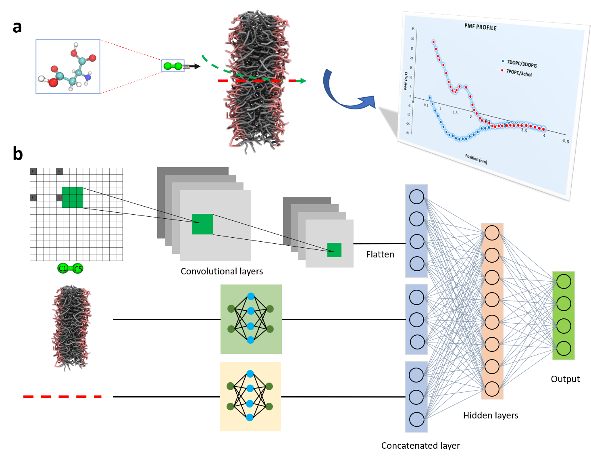

# DMInet: An Accurate and Highly Flexible Deep Learning Framework for Drug Membrane Interaction with Membrane Selectivity
DMInet model development

# Content
- data: the dataset for DMInet model development
- src: the source code for model development
- SI: supporting information with the paper below

# How to cite
Chen, Guang. "DMInet: An Accurate and Highly Flexible Deep Learning Framework for Drug Membrane Interaction with Membrane Selectivity." arXiv preprint arXiv:2105.13928 (2021).
